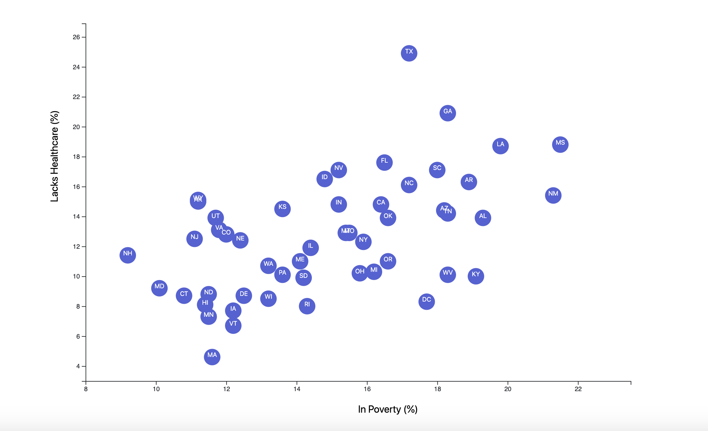

# D3-Challenge
## Project Summary

* The goal of this project was to create scatter plot out of a Census dataset containing health and demographic information. The chosen variables for this project were healthcare and poverty.

## Technologies Used

* JavaScript - D3
* HTML
* CSS

## The Process

* Setting up the chart required many adjustments throughout the process. It was central to the visualization's overall aesthetic.
* Obtaining the data from the csv required a promise that returned each data point as a number, created scales, formed/labeled axes, added circles to represent each data point, and append state abbreviations to each circle.

## Visual Observations
* Across the United States, there was a rough correlation between poverty and lack of healthcare. In general, the higher statewide poverty rate, the higher the healthcare-poor population.

## The Final Product: An Interactive Website
* Poverty vs Healthcare Scatter Plot:
 
